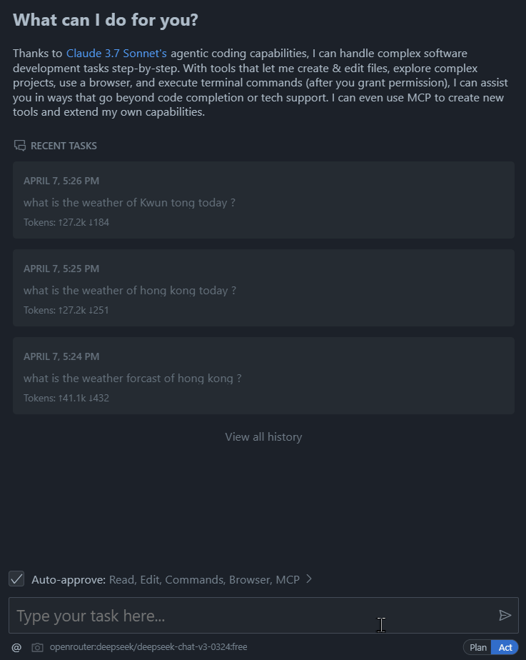

# hko_mcp

hko_mcp is a personal ("pet") project developed by louis as a learning exercise and technical playground. It focuses on integrating with the Hong Kong Observatory (HKO) and potentially other MCP (possibly a custom or third-party service) APIs. The project serves as a hands-on exploration of modern TypeScript tooling and testing practices.

## Technical Stack

tools included and configured:

- [TypeScript][typescript] [5.7][typescript-5-7]
- [ESM][esm]
- [ESLint][eslint] with some initial rules recommendation
- [Vitest][vitest] for fast unit testing and code coverage
- Type definitions for Node.js
- [Prettier][prettier] to enforce consistent code style
- NPM [scripts](#available-scripts) for common operations
- [EditorConfig][editorconfig] for consistent coding style
- Reproducible environments thanks to [Volta][volta]
- Example configuration for [GitHub Actions][gh-actions]
- Simple example of TypeScript code and unit test

## How to use

```bash
# 1. clone this repo
$ git clone https://github.com/louiscklaw/hko-mcp.git

# 2. configure environment
$ nvm use 22
$ node -v
# v22.14.0

# 3. build / test project
$ npm i -D
$ npm run build
$ npm run test

# 4. add below to your mcp configuration, (usually `cline_mcp_settings.json`)
{
  "mcpServers": {
    ... # add the thins below this line ...
    "hko-mcp": {
      "args": [
        "<clone_path>/hko-mcp/project/build/src/main.js"
      ],
    ... # line below are subject to your mcp client ...
      "disabled": false,
      "timeout": 60,
      "command": "node",
      "transportType": "stdio"
    }
  }
}
```

take `Cline` for example



## Available Scripts

- `clean` - remove coverage data, cache and transpiled files,
- `prebuild` - lint source files and tests before building,
- `build` - transpile TypeScript to ES6,
- `build:watch` - interactive watch mode to automatically transpile source files,
- `lint` - lint source files and tests,
- `prettier` - reformat files,
- `test` - run tests,
- `test:watch` - interactive watch mode to automatically re-run tests
- `test:coverage` - run test and print out test coverage

## Credits / Giants

- [node-typescript-boilerplate]

### Directories

- `_del`: place to store delete files, no need for project
- `documentation/REQ_xxx`: place to store requirements and specifications
- `project`: place to store source code

### PROGRESS/TODO

[progress]

---

[progress]: https://github.com/louiscklaw/mcp-hko/documentation/progress.md
[typescript]: https://www.typescriptlang.org/
[typescript-5-7]: https://devblogs.microsoft.com/typescript/announcing-typescript-5-7/
[eslint]: https://github.com/eslint/eslint
[prettier]: https://prettier.io
[volta]: https://volta.sh
[gh-actions]: https://github.com/features/actions
[esm]: https://developer.mozilla.org/en-US/docs/Web/JavaScript/Guide/Modules
[editorconfig]: https://editorconfig.org
[vitest]: https://vitest.dev

[node-typescript-boilerplate]: https://github.com/jsynowiec/node-typescript-boilerplate
