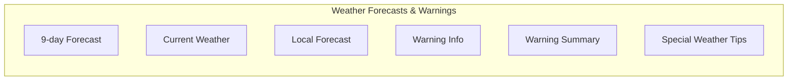
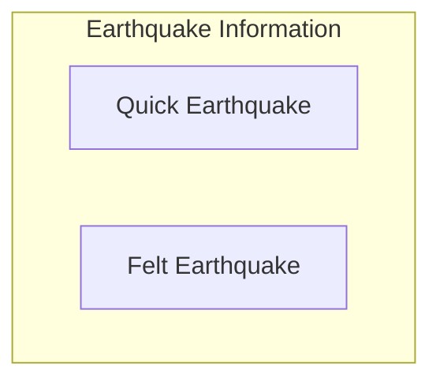
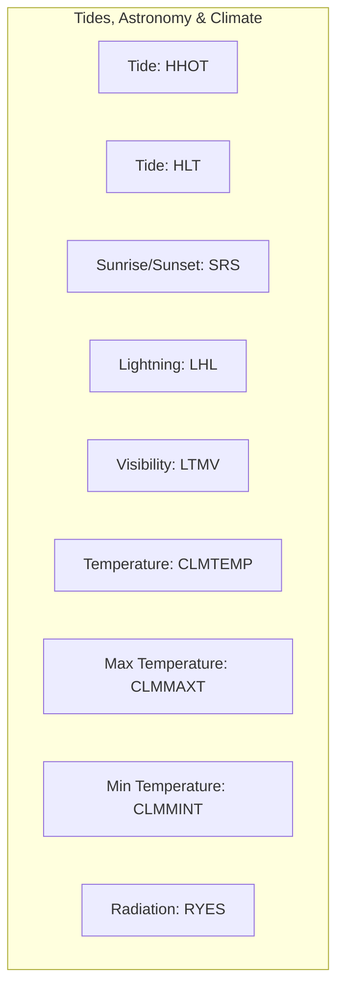
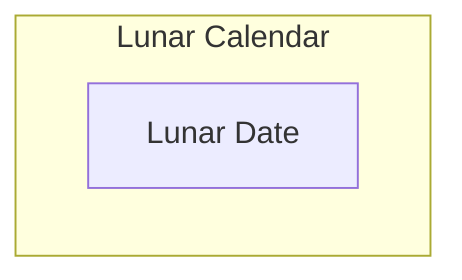
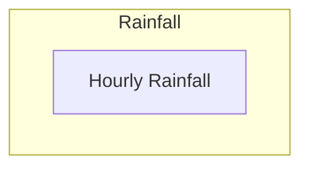

# mcp-hko (Hong Kong Observatory MCP Server)

This MCP server provides access to Hong Kong Observatory weather data APIs.
It implements various tools that allow clients to retrieve weather forecasts, earthquake information, tide data, and other meteorological information through the Model Context Protocol.

## Available Weather Data Tools

- 9-day Weather Forecast (**fnd**)
- Current Weather Report (**rhrread**)
- Local Weather Forecast (**flw**)
- Weather Warning Information (**warningInfo**)
- Weather Warning Summary (**warnsum**)
- Special Weather Tips (**swt**)
- Quick Earthquake Messages (**qem**)
- Locally Felt Earth Tremor Report (**feltearthquake**)
- Tide Information (**HHOT, HLT**)
- Astronomical Data (**SRS, lunardate**)
- Lightning and Visibility Data (**LHL, LTMV**)
- Temperature Records (**CLMTEMP, CLMMAXT, CLMMINT**)
- Radiation Level Reports (**RYES**)
- Rainfall Data (**hourlyrainfall**)

## Usage Examples

### Get 9-day weather forecast
> **prompt:**
>
> what is the weather in next Wed ?

### Get current weather report
> **prompt:**
>
> what is the weather now ?

## Development Setup

1. Install dependencies:
```bash
npm install
```

2. Start the MCP development server:
```bash
npm run inspect
```

3. Build the MCP server:
```bash
npm run build
```

## Configuration (Claude Desktop)
```json
{
  "mcpServers": {
    "mcp-hko": {
      "type": "stdio",
      "command": "npx",
      "args": [
        "-y",
        "github:louiscklaw/mcp-hko"
      ]
    }
  }
}
```

## Project Structure
- `src/` - Server source code
- `src/lib/` - API implementation modules
- `documentation/` - API documentation and test cases
- `scripts/` - Development utilities

## Server Architecture
The MCP server is built on the FastMCP framework and implements various tools that correspond to Hong Kong Observatory APIs.
The architecture is shown in two diagrams for better readability:

### Server Overview

### Detailed Tool Structure

#### REQ01xx: Weather Forecasts & Warnings


#### REQ02xx: Earthquake Information


#### REQ03xx: Tides, Astronomy & Climate


#### REQ04xx: Lunar Calendar


#### REQ05xx: Rainfall


## Credits:

- [mcp-hk-transport-eta](https://github.com/kennyfong19931/mcp-hk-transport-eta)
